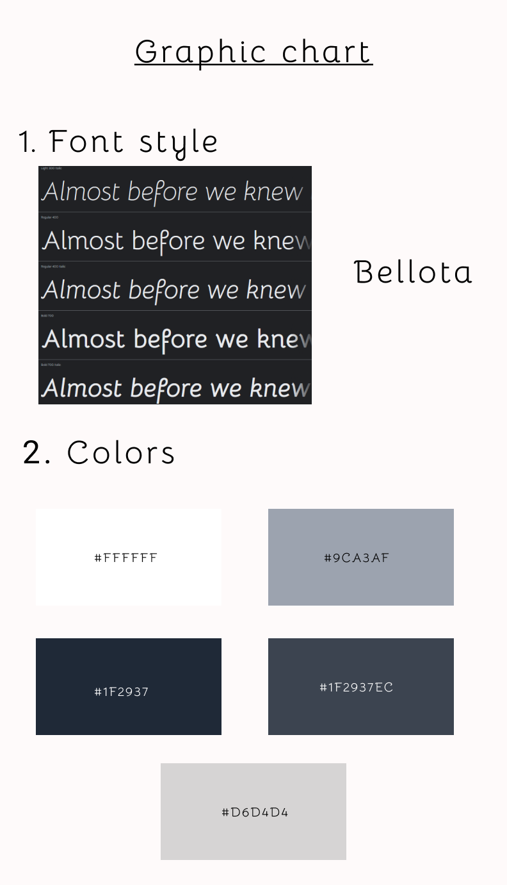

<h1 align="center">Portfolio</h1>

    
    
    
    
    
    
    
    
    
    

<i><strong>Work in progress...</strong></i>

<h2>Graphic chart</h2>

<h2>Objectives</h2>

- [x] Mock up
- [x] Choose a framework
- [x] Doing HTML/CSS
- [x] Fill the cards + btn mysql
- [ ] PHP
- [ ] subject 

<h2>Author</h2>

[@Calcagno Loïc](https://github.com/CalcagnoLoic)
